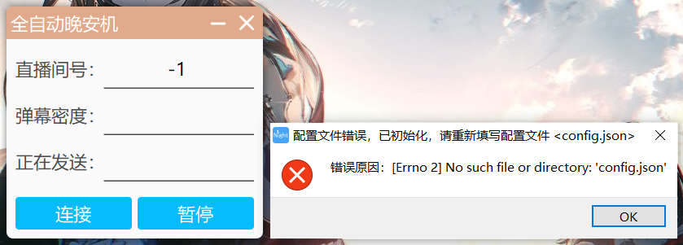

# 双击运行 `night.exe` 

#### 提示配置文件错误，这是因为没有初始化



打开自动生成于程序同一目录的 `config.json` 文件，填写参数前建议测试运行

#### 参数解释

`roomid` 表示监听直播间号，例如七海Nana7mi：21452505

`cookies` 表示发送弹幕的账号信息，获取方式下文详细介绍

`listening_words` 表示监听词汇，可添加、删除、修改

`goodnight_words` 表示发送晚安弹幕，可添加、删除、修改

`limited_density` 表示包含 监听词汇 的弹幕密度阈值

​	超过时将自动随机发送 `goodnight_words` 中弹幕

​	经测试，阈值设为 25 能取得较好效果，不建议设值小于 10

​	数值过小可能因自己发送的晚安弹幕超过阈值导致刷屏

`send_rate` 表示发送频率，单位秒，为保证不被过频繁，建议设置大于等于 1 的值

#### 测试运行

按照后文方法填写 `cookies` 中内容。注意，网页版退出登录会导致 `cookies` 失效

选取一无人直播间，避免测试过程打扰正常直播，填写该直播间 `roomid`

将 `limited_density` 值设置为 0 即无条件触发自动发送晚安

填写完成后运行软件，测试是否能看见自动发送的弹幕

若无明显错误，请及时修改 `roomid` `limited_density` 参数以正常使用

如果有错误，我不知道咋办😋


# 获取 Credential 类所需信息

Credential 类实例化代码如下：

```python
from bilibili_api import Credential

credential = Credential(sessdata="你的 SESSDATA", bili_jct="你的 bili_jct", buvid3="你的 buvid3")
```

`sessdata` `bili_jct` 和 `buvid3` 这三个参数的值均在浏览器的 Cookies 里头，下面说明获取方法。

## 火狐浏览器（Firefox）

1. 按 **F12** 打开开发者工具。


2. 在工具窗口上方找到 **存储** 选项卡。


3. 展开左边的 **Cookie** 列表，选中任一b站域名。在右侧找到对应三项即可。


## 谷歌浏览器（Chrome）

1. 按 **F12** 打开开发者工具。


2. 在工具窗口上方找到 **Application** 选项卡。


3. 在左侧找到 **Storage/Cookies**，并选中任一b站域名，在右侧找到对应三项即可。


## 微软 Edge

1. 按 **F12** 打开开发者工具。


2. 在工具窗口上方找到 **应用程序** 选项卡 。


3. 在左侧找到 **存储/Cookies**，并选中任一b站域名，在右侧找到对应三项即可。

